# ⚽ Autonomous Football Shorts Pipeline

An end-to-end **agentic content automation system** that detects live football
matches, generates AI commentary, synthesizes voiceover audio, renders
vertical video, and publishes to YouTube — fully unattended, on a schedule.

No part of the publish loop is manual. A scheduled trigger fires every run;
everything from "is there a live match right now" to "video is live on
YouTube" is handled by a chain of 14 orchestrated nodes with fallback
behavior at the points most likely to fail.

---

## Why this project exists

Most "AI YouTube automation" projects are a single API call wrapped in a cron
job. This one is closer to a small distributed system: it pulls from a live
sports data API, makes a content/config decision based on a Google Sheet
acting as a queue, calls an LLM for generation, calls a TTS API, calls a
video-rendering API with **polling + wait logic** for an async render job,
then uploads and logs the result — handling the case where the render isn't
ready yet, and the case where no live match exists at all.

The point of building it wasn't really "make a football channel." It was
designing a pipeline that has to make decisions and handle failure across
six different external services without a human in the loop.

---

## Architecture

```mermaid
flowchart LR
    A[Schedule Trigger] --> B[Get row from Sheet\nconfig: topic / video_type]
    B --> C[HTTP: API-Football\nfetch live fixtures]
    C --> D[Code Node: JS\nnormalize fixture data\n+ fallback if no live match]
    D --> E[Groq LLM Chain\nllama-3.1-8b-instant\ngenerate commentary script]
    E --> F[HTTP: TTS API\ntext to speech]
    F --> G[Upload audio\nto Google Drive]
    G --> H[HTTP: Creatomate\nstart async video render]
    H --> I[Wait Node]
    I --> J[HTTP: Poll render status]
    J -->|not ready| I
    J -->|succeeded| K[Wait Node]
    K --> L[HTTP: Fetch final video URL]
    L --> M[Upload video to YouTube]
    M --> N[Update row in Sheet\nlog status + result]
```



### Pipeline stages

| Stage | Node(s) | What it does |
|---|---|---|
| Trigger | `Schedule Trigger` | Fires the pipeline on a fixed interval |
| Config read | `Get row(s) in sheet` | Pulls the next topic / video type from a Sheet acting as a content queue |
| Live data | `HTTP Request` | Calls api-sports.io for currently live fixtures |
| Normalize + fallback | `Code in JavaScript` | Flattens API response into a clean object; falls back to a default matchup if nothing is live, so the schedule never silently fails |
| Commentary generation | `Basic LLM Chain` + `Groq Chat Model` | Generates a 40–60 word ESPN-style commentary script via Llama 3.1 8B on Groq |
| Voice synthesis | `HTTP Request1` | Converts the script to speech audio |
| Asset storage | `Upload file` (Google Drive) | Stores the audio asset for the renderer to pull from |
| Video render | `HTTP Request2` → `Wait` → `HTTP Request3` (poll) | Starts an async render job on Creatomate and polls until it's done — render jobs aren't instant, so this is a real poll loop, not a fixed delay |
| Fetch + publish | `Wait1` → `HTTP Request4` → `Upload a video` | Retrieves the finished render and publishes directly to YouTube via OAuth2 |
| Logging | `Update row in sheet` | Writes the run's result back to the Sheet for tracking/debugging |

---

## Stack

- **Orchestration:** [n8n](https://n8n.io) (self-hosted)
- **LLM:** Groq — `llama-3.1-8b-instant`
- **Text-to-speech:** VoiceRSS (swappable for ElevenLabs)
- **Video rendering:** [Creatomate](https://creatomate.com) (template-based, programmatic)
- **Live sports data:** [API-Football](https://www.api-football.com/) (api-sports.io)
- **Storage / queue:** Google Sheets (config + run log), Google Drive (audio assets)
- **Publishing:** YouTube Data API (OAuth2)

---

## Repo contents

```
.
├── workflow/
│   └── Football_Automation.sanitized.json   # importable n8n workflow (secrets stripped)
├── src/
│   └── transform-fixture-data.js            # standalone copy of the Code node, documented
├── assets/
│   ├── workflow-overview.png                # full pipeline view in n8n
│   └── published-shorts.png                 # live results on YouTube Studio
├── docs/
│   └── SETUP.md                             # how to import + configure this yourself
├── .env.example
└── .gitignore
```

---

## Engineering notes / failure handling

- **No live match available** — handled in the Code node with a default
  fallback fixture, so a scheduled run never fails just because no match is
  currently live.
- **Async render jobs** — Creatomate renders aren't synchronous. The
  pipeline uses `Wait` + a polling `HTTP Request` rather than assuming a
  fixed render time, since render duration varies.
- **Credential isolation** — every external call uses n8n's native
  credential store (OAuth2 for Google/YouTube, API key injection for
  Groq/Creatomate/API-Football) rather than hardcoding secrets into node
  parameters. The version of the workflow JSON in this repo has all key
  values replaced with placeholders — see `.env.example`.
- **Run logging** — every execution writes its outcome back to a Sheet,
  giving a lightweight audit trail without standing up a database.

## Results so far

Early-stage, low-volume publishing while the pipeline is being tuned —
see `assets/published-shorts.png` for actual YouTube Studio output. The
focus of this project is the orchestration system itself, not channel
growth.

## Possible extensions

- Swap Creatomate template selection based on `video_type` for visual variety
- Add a moderation/QC step before publish (LLM self-check on the generated script)
- Move the Sheet-based queue to a proper database once volume increases
- A/B test commentary tone/length against view retention

---

## License

MIT — see [LICENSE](LICENSE).
